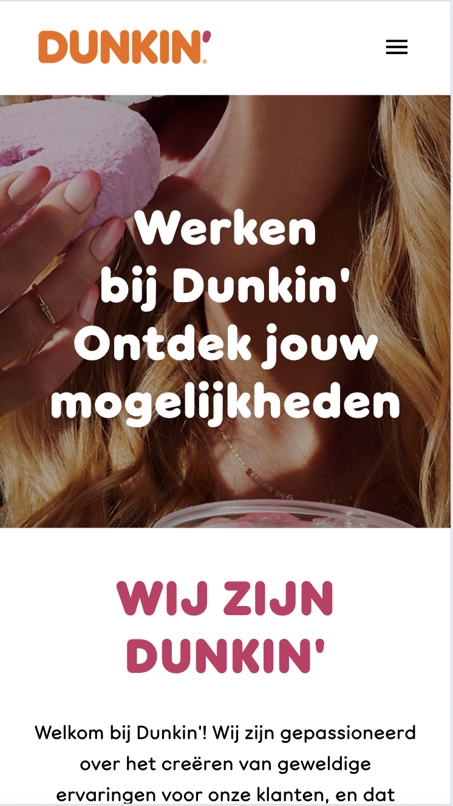

# Procesverslag
Markdown is een simpele manier om HTML te schrijven.  
Markdown cheat cheet: [Hulp bij het schrijven van Markdown](https://github.com/adam-p/markdown-here/wiki/Markdown-Cheatsheet).

Nb. De standaardstructuur en de spartaanse opmaak van de README.md zijn helemaal prima. Het gaat om de inhoud van je procesverslag. Besteedt de tijd voor pracht en praal aan je website.

Nb. Door *open* toe te voegen aan een *details* element kun je deze standaard open zetten. Fijn om dat steeds voor de relevante stuk(ken) te doen.

## Jij

  
uitwerken voor kick-off werkgroep

  ### Auteur:
  Eva van Wissen

  #### Je startniveau:
  Mijn niveau is de Blauwe piste. Ik codeer niet in mijn vrije tijd en vind het soms nogal moeilijk. Maar als ik het snap kan ik het ook heel leuk vinden. 

  #### Je focus:
  Surface plane
 

## Je website

  
uitwerken voor kick-off werkgroep

  ### Je opdracht:
  https://www.dunkin.nl/

  #### Screenshot(s) van de eerste pagina (small screen): 
  hier de naam van de pagina  
    

  #### Screenshot(s) van de tweede pagina (small screen):
  hier de naam van de pagina  
  
  
 

## Toegankelijkheidstest 1/2 (week 1)

  
uitwerken na test in 2e werkgroep

  ### Bevindingen
  - Screenreader: 
    - Bij hover worden de kopjes niet genoemd.
    - Geeft foute instructies: om te klikken gebruik deze toets. (maar werkt niet)
    - Er wordt heel veel gezegd: chaotisch.
    - Moet iets selecteren voor dat het opgenoemd wordt.
    - Laad-schermen worden afbeeldingen genoemd.
    - Wanneer ik op nieuwe pagina kom gaat die alle linkjes langs.
    - Zegt veel “Ga terug”

  - WCAG checklist
    - Er wordt weinig/geen alt gebruikt
    - Er worden voor elke pagina unieke titels gegeven 
    - focus style op keyboard werkt, maar onlogische volgorde 
    - headings worden niet goed gebruikt 
    - List wordt ook niet gebruikt op elementen die het wel nodig hebben
    - Heel veel divs en spans 
    - Geen audio of video 
    - <a> wordt goed gerbuikt 
    - Button wordt niet goed gebruikt
    - Subtiele animaties 
    

## Breakdownschets (week 1)

  
uitwerken na afloop 3e werkgroep

  ### de hele pagina: 
  

  ### dynamisch deel (bijv menu): 
  

  ### wellicht nog een dynamisch deel (bijv filter): 
  

## Voortgang 1 (week 2)

  
uitwerken voor 1e voortgang

  ### Stand van zaken
  - Ik was mijn code kwijtgeraakt. Uiteindelijk weer terug gevonden
  - Weet niet hoe ik een img in een container kan zetten (hem laten afkappen buiten de container)
  - Hoe moet ik de Dunkin Donuts font dowloaden/ inladen
  - Moet ik <list> gebruiken? Zo ja, hoe haal ik de 1, 2, 3 weg. 
  - Klopt mijn html? Of maak ik geen goed gebruik van sections en articles?

  ### Agenda voor meeting
  samen met je groepje opstellen

  | student 1      | student 2          | student 3    | student 4        |
  | ---            | ---                | ---          | ---              |
  | dit bespreken  | en dit             | en ik dit    | en dan ik dat    |
  | en dat ook nog | dit als er tijd is | nog een punt | dit wil ik zeker |
  | ...            | ...                | ...          | ...              |

  ### Verslag van meeting
  hier na afloop snel de uitkomsten van de meeting vastleggen

  - Ik weet nu hoe ik elementen/img makkelijk kan positioneren (met transform) maar snap toch nog niet helemaal hoe ik mijn img snijd. 
  - Ben geholpen met het dowloaden van de juiste font. Hoe ik het nou precies in html/css moet zetten ging te snel en is voor mij nog steeds onduidelijk. 
  - Ben goed geholpen met mijn <list> en kan daarmee weer goed doorwerken. 
  - Mijn html ziet er goed uit en kan zo doorgaan. 

## Voortgang 2 (week 3)

  
uitwerken voor 2e voortgang

  ### Stand van zaken
  hier dit ging goed & dit was lastig (neem ook screenshots op van delen van je website en code)

   

  - In een van de lessen heb ik nog hulp kunnen krijgen met het inladen van de juiste font. Ik heb alleen nu het probleem dat het font niet dunner wordt. 
  - Toen ik het juiste font in mijn site zette, kwamen twee linkjes onder elkaar te staan in plaats van naast elkaar zoals dat vorheen was. Hoe verander ik dit? 
  - Het afnsijden van een img is me nog steeds niet gelukt en wil hier nog vragen over stellen. 
  - 

  ### Agenda voor meeting
  samen met je groepje opstellen

  | student 1      | student 2          | student 3    | student 4        |
  | ---            | ---                | ---          | ---              |
  | dit bespreken  | en dit             | en ik dit    | en dan ik dat    |
  | en dat ook nog | dit als er tijd is | nog een punt | dit wil ik zeker |
  | ...            | ...                | ...          | ...              |

  ### Verslag van meeting
  hier na afloop snel de uitkomsten van de meeting vastleggen

  - Ik mis nog Costum Properties.
  - Ik kan het afnsijden van de afbeeldingen proberen met object: fit; en object position. 
  - Ik ben goed geholpen met de krijgen van een dunnere versie van de font. 
  - Linkjes kan ik met grid proberen naast elkaar te zetten. 

## Toegankelijkheidstest 2/2 (week 4)

  
uitwerken na test in 9e werkgroep

  ### Bevindingen
  Lijst met je bevindingen die in de test naar voren kwamen (geef ook aan wat er verbeterd is):

## Voortgang 3 (week 4)

  
uitwerken voor 3e voortgang

  ### Stand van zaken
  hier dit ging goed & dit was lastig (neem ook screenshots op van delen van je website en code)

  - Ik heb een hamburger menu, maar ben niet tevreden met het kruisje. Is het goed zo? Zo niet, hoe verander ik het. 
  - Ik heb een animatie, maar deze positioneert zich niet zoals ik wil. Hoe fix ik dit?
  - In de Dunkin site, schuift het balkje bovenaan naar boven bij het scrollen. Hoe doe ik dit? 
  - Ik heb mijn images naar svg's veranderd, maar ze zijn nu ontzichtbaar. Hoe krijg ik ze terug? 
  - Ik heb van sommige elementen op de Dunkin site screenshots gemaakt en deze als images in mijn html gezet. Mag dit? 
  - wat moet ik nu nog toevoegen aan surface plane onderweroen toevoegen? 
  - Hoe maak ik mijn light-dark mode kloppend met de custom properties?

  ### Agenda voor meeting
  samen met je groepje opstellen

  | student 1      | student 2          | student 3    | student 4        |
  | ---            | ---                | ---          | ---              |
  | dit bespreken  | en dit             | en ik dit    | en dan ik dat    |
  | en dat ook nog | dit als er tijd is | nog een punt | dit wil ik zeker |
  | ...            | ...                | ...          | ...              |

  ### Verslag van meeting
  hier na afloop snel de uitkomsten van de meeting vastleggen

  - Ik ben geholpen met mijn hamburger menu. Ik zou hem nog beter kunnen maken als ik zou willen, maar alleen als ik daar nog tijd voor zou hebben. 
  - Ik weet nu hoe ik mijn animatie goed kan positioneren.
  - De balk bovenaan doet heel raar wanneer ik het verschuiven ervan wilt toepassen. Alles veranderd en hij doet niet wat ik wil. 
  - Helaas wist Danny ook niet waarom mijn svg's ontzichtbaar waren. Daarom heb ik ze met een  tag in mijn html gezet. Nu zie je ze wel, maar kan ik ze niet gebruiken voor mijn svg-animatie. 
  - De screenshots waren geen probleem en die kan ik houden. 
  - Ik snap nu hoe ik in css met de costum properties om kan gaan. 
  - Ik weet nu wat ik nog moet toevoegen aan surface plane onderwerpen. 

## Eindgesprek (week 5)

  
uitwerken voor eindgesprek

  ### Je uitkomst - karakteristiek screenshots:
  

  

  

  

  

   
   
  
  

  ### Dit ging goed/Heb ik geleerd: 
  - Aan het begin van dit vak had ik nog een beetje moeite met de opmaak van alle blokken op de homepagina. Maar na veel proberen en oefenen lukte mij dit steeds beter en sneller. Ik heb bijvoorbeeld geleerd hoe je makkelijk elementen kan centreren. Hierbij ben ik ook beter gaan begrijpen hoe de plaatsing van elementen werken (margin, padding, border. Maar ook met transform, flex, grid, etc). 

  

  

  

  

  

  

   - Ook heb ik geleerd hoe costum properties/ light-dark-mode werkt. Dit vond ik eerst lastig, maar nadat ik hier wat vragen over had gesteld, begreep ik het en ging het toevoegen hiervan ook goed. Ook heb ik geleerd hoe je met svg-images om moet gaan en hoe je deze kan stijlen en animeren. Het dowloaden van fonts is me ook een stuk duidelijker geworden. Ik begrijp nu veel beter hoe je deze in je html/css zet en hoe je deze bewerkt. 

  

  

  

  - Verder heb ik bij dit vak heel veel geleerd over animaties, transitions, JS, audio, etc. Soms gingen sommige dingen niet helemaal goed, maar met hulp in de les of onderzoek op het internet ben ik er bij de meeste dingen wel uitgekomen. 

 

  ### Dit was lastig/Is niet gelukt:
Er zijn helaas ook wat dingen niet gelukt, namelijk: 

- een scrol-animatie. Ik heb van de docent een linkje gekregen van een site waar helemaal wordt uitgelegd hoe je dit zou moeten maken. Ik heb van alles geprobeerd, maar het bleef maar mislukken. Ook met verder onderzoek ben ik er niet uitgekomen. Uiteindelijk heb ik besloten om dit te laten en deze te vervangen met een ander surface-plane onderwerp, namelijk een pop-up. 

- Ook is het me helaas niet gelukt om het bovenste balkje op mijn site mee te laten bewegen met de scrol richting. Ook hier heb ik van de docent een codepen linkje gekregen. Toen dit eerst niet lukte, was ik erachter gekomen dat ik de p van de <nav> naar de <header> moest verplaatsen. Na heel veel verschuiven en proberen heb ik deze uiteindelijk op de goede plek gekregen. Maar het mee scrollen van deze balk is me uiteindelijk helaas niet gelukt. Bij het toevoegen hiervan, verschoof de balk of deed die niks. Wel pakte die soms de "order now" balk onderin. 

- Helaas is het me ook niet gelukt om de foto's op de tweede pagina niet te laten vervormen. Ik heb gebruikt gemaakt van object-fit, overlay:hidden, grid, en nog meer. Maar de foto's bleven vervormd. 

## Bronnenlijst

  
continu bijhouden terwijl je werkt

  Nb. Wees specifiek ('css-tricks' als bron is bijv. niet specifiek genoeg). 
  Nb. ChatGpT en andere AI horen er ook bij.
  Nb. Vermeld de bronnen ook in je code.

  1. https://dev.to/jslim/fading-up-sections-using-intersection-observer-3fhj
  Voor een fade-scrol animatie. 
  2. https://chatgpt.com/c/66f6ec98-7040-8002-8e17-ffeaf060c985
  Voor het toevoegen van audio en svg-animatie
  3. https://chatgpt.com/c/66f70871-8fac-8002-81da-0f3d03806e23
  Voor het werkend laten maken van een svg-animatie
  4. https://chatgpt.com/c/66f7b429-ca0c-8002-9b86-cbeac6ba9abc
  Voor het maken van een pop-up
  5. Andrea 
  Voor het maken van een hamburger menu 
  6. Ali (studentassistent)
  Voor het maken van een hamburger menu 
  7. https://dlo.mijnhva.nl/d2l/le/content/609314/Home
  Voor codepen opdrachten. 
  

